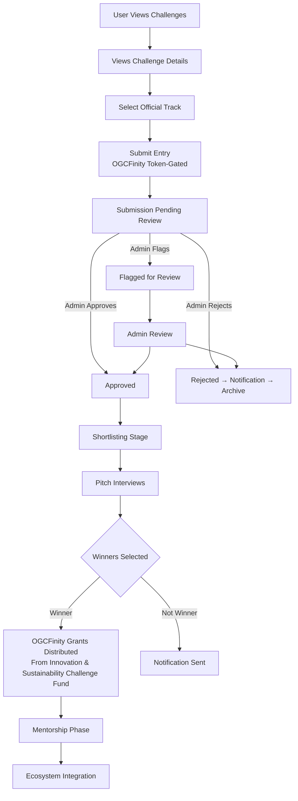

# OGC NewFinity Platform — Detailed Challenge Flow

**Version:** v1.0

**Maintained by:** OGC Technologies

**Status:** Active Documentation (Internal; Flow Specification)**

## 1. Purpose

This document provides a fully detailed flow specification for the Challenge System, covering:

- User flow
- Admin flow
- Submission lifecycle
- Rewards logic
- Contribution logging
- Badge synchronization
- Notification triggers
- Error conditions
- Phase 2 & Phase 3 expansions
- System interactions (Wallet, Contribution, Amy Agent, Governance)

This is the authoritative reference for backend, frontend, and admin tool implementations.

## 2. High-Level Flow Overview

**Main Stages:**

1. User browses challenges
2. User views challenge details
3. User submits challenge entry
4. Admin reviews submission
5. Admin approves/rejects
6. Rewards issued
7. Contribution updated
8. Badges updated
9. Notifications sent
10. Challenge closes
11. Archive and statistics generated

## 3. User Flow (Step-by-Step)

### 3.1 Browsing Challenges

User → Dashboard → Challenge Feed (`GET /api/challenges`)

User sees:

- Active challenges
- Closing soon
- Categories
- Rewards previews

### 3.2 Viewing Challenge Details

User → `/challenges/:id` → GET challenge details

Details include:

- Description
- Rules
- Category
- Reward points
- Allowed file formats
- Deadline

### 3.3 Creating a Submission

User clicks "Submit Entry" →

User uploads file or content →

`POST /api/challenges/:id/submit`

**Validations:**

- Within deadline
- File type allowed
- User not suspended

### 3.4 Submission Created (Pending Review)

Submission stored →

Status = "pending"

### 3.5 User Views Their Submissions

`GET /api/challenges/:id/submissions/me`

## 4. Admin Flow (Step-by-Step)

### 4.1 Admin Browses Submissions

Admin → Dashboard → Challenges → Submissions

`GET /api/admin/challenges/:id/submissions`

### 4.2 Admin Approves Submission

`POST /api/admin/challenges/submission/approve`

**Effects:**

- Submission marked as approved
- Reward event triggered
- Contribution points added
- Badge progression updated
- Notification sent

### 4.3 Admin Rejects Submission

`POST /api/admin/challenges/submission/reject`

**Effects:**

- Status set to rejected
- Rejection reason stored
- Notification sent

### 4.4 Admin Flags Submission

`POST /api/admin/challenges/submission/flag`

**Effects:**

- Status = flagged
- Admin review queue updated

### 4.5 Admin Closes Challenge

`POST /api/admin/challenges/close/:id`

**Effects:**

- Challenge locked
- No new submissions
- Final statistics calculated

## 5. Submission Lifecycle (Full Sequence)

```
pending → approved → rewarded → archived
pending → rejected → archived
pending → flagged → admin_review → approved/rejected
```

## 6. Reward Logic (Phase 1)

**Default reward points:**

- Standard creative/knowledge challenges: +10
- Difficult challenges: +15
- Special event challenges: +20

**Reward triggers:**

```
on submission_approved:
  contribution += reward_points
  if badge criteria met:
      assign badge
  log reward event
  send notification
  update analytics
```

## 7. Badge Flow Integration

Badges triggered by:

- Number of approved submissions
- Category-based achievements
- Consecutive participation
- Special events

**Flow:**

```
submission approved →
badge evaluation →
badge awarded (if applicable) →
notification sent →
wallet/score updated
```

## 8. Notifications Trigger Points

**User Notifications**

- Submission received
- Submission approved
- Submission rejected
- Challenge closed
- Reward earned
- Badge earned

**Admin Notifications**

- Flagged submissions
- Abuse reports
- Challenge ready to publish (future)

## 9. Error Handling Flow

**When Submission Fails**

**Reasons:**

- Invalid file format
- Challenge closed
- Deadline passed
- Account suspended

**Error response:**

```json
{
  "status": "error",
  "message": "Submission not allowed."
}
```

## 10. Phase 2 Additions

### 10.1 Voting Flow

After submissions close:

- Users vote →
- Votes logged →
- Results published →
- Extra rewards distributed

### 10.2 Challenge Ranking

Leaderboard generated using:

- Community votes
- Admin scoring
- Hybrid weighting

### 10.3 Multi-Submission Challenges

Users submit multiple entries in some categories (premium).

## 11. Phase 3 Extensions

### 11.1 Governance-Linked Challenges

- Governance users propose challenge types
- Governance users vote on monthly special challenges

### 11.2 Staked Voting Power

Voting weight influenced by stake (Phase 3):

```
vote_weight = stake_amount × multiplier
```

## 12. Full System Interaction Flow Diagram (Standardized)

**Note:** For the official standardized Challenge Program flow diagram, see:
- `docs/mermaid/00-standardized/challenge-program-flow-standardized.mmd`

The standardized flow includes:
- User → Select Track → Submit Project (OGCFinity token-gated) → Review Stage → Shortlisting → Pitch Interviews → Winners Selected → OGCFinity Grants Distributed → Mentorship Phase → Ecosystem Integration

**Detailed Implementation Flow:**



## 13. Database Interaction Summary

**Tables involved:**

- `CHALLENGES`
- `SUBMISSIONS`
- `USERS`
- `CONTRIBUTION_EVENTS`
- `BADGES`
- `USER_BADGES`
- `NOTIFICATIONS`
- `ACTIVITY_LOG`
- `ADMIN_LOG`

Every admin action is logged with:

- `admin_id`
- `user_id`
- `event_type`
- `metadata`
- `timestamp`

## 14. Endpoints Used (Cross-Reference)

From:

- `/docs/api/challenge-api-blueprint.md`
- `/docs/api/admin-api-blueprint.md`
- `/docs/api/notification-api-blueprint.md`
- `/docs/contribution/contribution-system-spec.md`
- `/docs/badges/badges-and-levels-spec.md`

