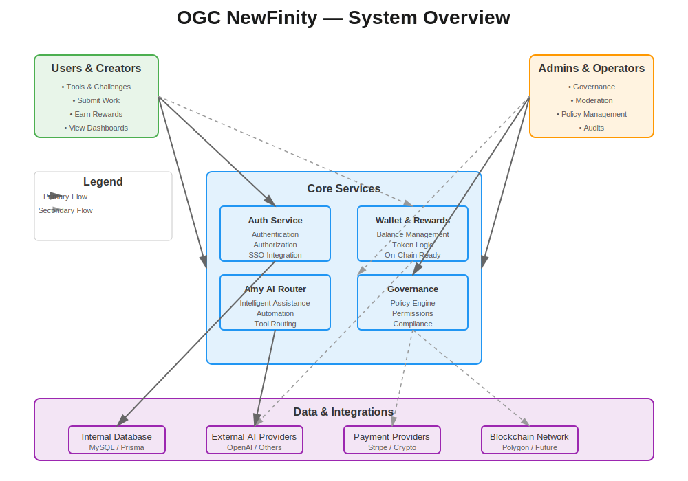

# OGC NewFinity Platform — Documentation Hub

Welcome to the **OGC NewFinity Platform documentation**.  
This hub is designed for everyone who needs to understand the platform:

- Core team and contributors  
- External developers and architects  
- Advisors, partners, and potential investors  

It gives a **high-level story** of the system, plus deep technical detail when you need it.

---

## 1. What is OGC NewFinity?

OGC NewFinity is a **modular, AI-enhanced contribution platform** built around:

- **User dashboards** for tools, challenges, and rewards  
- **Wallet & token logic** for balances, rewards, and future on-chain flows  
- **Amy AI Router** for intelligent assistance and automation  
- **Governance & policy** for safe and controlled growth  

The platform is being developed in phases, with **documentation and diagrams** serving as the source of truth.

---

## 2. System at a Glance

The diagram below shows the platform at a high level: who interacts with it, which core services sit at the center, and how data flows between internal and external systems.

**Key domains:**

- **Users & Creators** – work with tools, submit challenges, earn rewards  
- **Admins & Operators** – manage governance, moderation, policy, and audits  
- **Core Services** – Auth, Wallet & Rewards, Amy AI Router, Governance  
- **Data & Integrations** – internal databases and external AI/payment providers  

For deeper flows, see the **Mermaid diagram library** and **API contracts** sections below.

---

## 3. Who This Documentation Is For

### 🔹 Developers & Engineers

- Need to understand **architecture**, **flows**, and **APIs**  
- Want to see **sequence diagrams**, **data models**, and **service boundaries**  
- Use this repo as the **contract** between frontend, backend, and future services

Start here:

- [`docs/quickstart.md`](./quickstart.md) – Developer Quickstart Guide  
- [`docs/structure-map.md`](./structure-map.md) – Repository map  
- [`docs/mermaid/index.md`](./mermaid/index.md) – Diagram index  

---

### 🔹 Collaborators & Technical Friends

- Want a **visual overview** of how the system works  
- May help refine architecture, security, or data flows  
- Don't need every implementation detail, but want clarity and consistency

Start here:

- **System Overview** (this page)  
- [`docs/developer-onboarding.md`](./developer-onboarding.md) – Deeper context  
- `docs/mermaid/03-platform-flows/` – User and dashboard flows  

---

### 🔹 Advisors, Partners, and Investors

- Need to understand **what is being built**, **why it matters**, and **how it scales**  
- Care about **architecture quality**, **governance**, and **future extensibility**

Recommended reading:

- [`docs/documentation-overview.md`](./documentation-overview.md) – How everything fits together  
- `docs/mermaid/02-architecture/` – Core architecture diagrams  
- `docs/mermaid/07-wallet-architecture/` – Wallet, rewards, and on-chain strategy  
- `docs/rfc/` – Selected RFCs showing how changes are proposed and approved  

This documentation is intentionally structured to show that the platform is **designed, not improvised**.

---

## 4. Start Here — Quick Navigation Cards

### 🧭 Core Orientation

- **Quickstart:** [`docs/quickstart.md`](./quickstart.md)  
  → Fast onboarding for new developers

- **Structure Map:** [`docs/structure-map.md`](./structure-map.md)  
  → One-page view of the repo layout

- **Documentation Overview:** [`docs/documentation-overview.md`](./documentation-overview.md)  
  → What each doc area is responsible for

---

### 🧩 Architecture & Flows

- **Architecture Diagrams:** `docs/mermaid/02-architecture/`  
- **Platform Flows:** `docs/mermaid/03-platform-flows/`  
- **Unified Master Flow:** `docs/mermaid/04-unified-master-flow/`  

These show **how users move through the system** and how services interact.

---

### 💰 Wallet, Rewards, and On-Chain

- **Wallet Architecture:** `docs/mermaid/07-wallet-architecture/`  
- **Wallet & Rewards Data Flow:** see Phase 7 diagrams  
- **Future on-chain integration:** described in wallet diagrams + RFCs  

These documents are especially relevant for discussions around **tokenomics** and **future blockchain integration**.

---

### 🤖 Amy AI Agent & Automation

- **Amy Agent Overview:** `docs/mermaid/09-amy-agent/`  
- **Tools & Phases:** Phase 9.x diagrams  
- **Routing, credits, and data flow:** sequence diagrams in Phase 9  

This area is central to the platform's **AI-driven differentiation**.

---

### ⚖ Governance, Permissions, and Compliance

- **Governance Overview:** `docs/mermaid/06-governance/`  
- **Permissions Matrix:** `phase-6.2-...` diagram  
- **Escalation & Moderation:** Phase 6.x diagrams  
- **Audit & Compliance:** Phase 6.4 diagrams  

These show that **rules, escalation paths, and audits** are considered from the start.

---

## 5. How the Docs Are Organized

The documentation is intentionally split into clear areas:

- **Mermaid Diagrams (`docs/mermaid/`)**  
  Visual flows for architecture, wallet, governance, APIs, and Amy.

- **API Blueprints (`docs/api/`)**  
  Human-readable contracts for Auth, Wallet, Amy Router, and others.

- **Testing & Quality (`docs/tests/`, `docs/ci/`)**  
  How we will keep behavior reliable over time.

- **RFCs (`docs/rfc/`)**  
  Proposals for significant changes, with structure and decision history.

- **Automation & Future Site (`docs/automation/`, `docs/site/`)**  
  Foundations for auto-diagram generation and static documentation hosting.

---

## 6. Principles Behind the System

A few guiding principles that shape OGC NewFinity:

1. **Architecture First** – diagrams and docs before implementation chaos  
2. **Separation of Concerns** – clear boundaries for Auth, Wallet, Amy, Governance, etc.  
3. **Documented Contracts** – APIs and flows are written down, not only in code  
4. **Governed Growth** – governance and audit are part of the design, not an afterthought  
5. **Future-ready** – the platform is built to evolve (more tools, dashboards, and integrations)

---

## 7. Contributing & Reviewing

If you are:

- **Joining the build** → start with `quickstart.md` and `developer-onboarding.md`  
- **Reviewing architecture** → look at `02-architecture`, `07-wallet-architecture`, and `09-amy-agent`  
- **Advising or investing** → combine this page with architecture and wallet sections for a full picture  

As the platform grows, this landing page will remain the **entry point** and will be updated to reflect major milestones.
