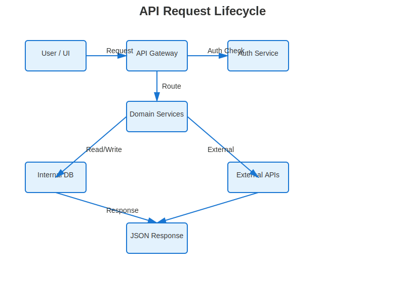
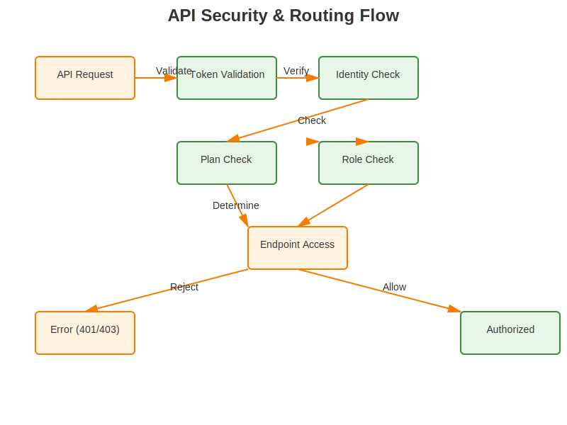
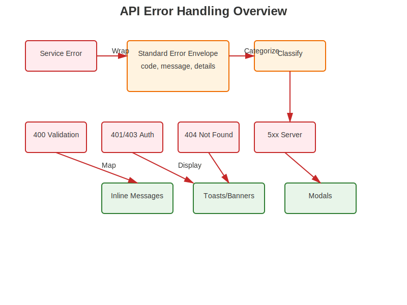

# Phase 8 — API Contracts Overview

Phase 8 defines how the OGC NewFinity Platform exposes stable, secure, and well-documented APIs.  
This overview focuses on **how requests flow**, **how security is enforced**, and **how errors are surfaced** to the UI.

---

## 1. High-Level API Request Lifecycle

The diagram below shows the journey of a typical API request—from the user interface to internal or external services and back:

**Flow (simplified):**

1. **User / UI** triggers an action (button click, form submit, navigation).

2. The **API Gateway** receives the request and routes it to the appropriate domain:

   - Auth, Wallet, Amy, Challenges, Governance, etc.

3. For protected routes, the gateway coordinates with:

   - **Auth Service** → token and session checks  

   - **Domain Services** → Wallet Service, Amy Router, Challenge Service, and others.

4. Domain services read/write from:

   - **Internal DB / Protected APIs**  

   - **External APIs** where needed (AI providers, payment services, analytics, etc.)

5. A normalized JSON response is returned to the UI and mapped to view models.

---

## 2. Security, Roles, and Plans

All authenticated requests pass through a consistent security layer.

**Key points:**

- Requests are validated for:

  - token integrity (signature, expiry)

  - user identity

  - plan / subscription level (Free, Pro, Team, Enterprise)

- Role and plan checks determine:

  - which endpoints are available

  - which features are enabled (for example, advanced Amy tools or premium wallet actions)

- On failure, the API returns structured error responses with clear codes (401, 403, etc.).

This aligns with the governance and permissions models defined in earlier phases.

---

## 3. Error Handling and UI Experience

The platform aims for **predictable, consistent error behavior** across all APIs.

**Principles:**

- Services return a **standard error envelope**:

  - `code` (machine-readable)

  - `message` (user-facing)

  - `details` (optional, for developers or logs)

- Errors are classified:

  - validation issues (400)

  - auth/permission errors (401 / 403)

  - not-found (404)

  - server / integration issues (5xx)

- The UI maps errors to:

  - inline validation messages

  - non-blocking toasts or banners

  - blocking modals for critical failures

This keeps the **user experience coherent** even when different services are involved.

---

## 4. Relationship to Other Documents

Phase 8 works together with:

- **API blueprints:**  

  `docs/api/auth-api-blueprint.md`  

  `docs/api/wallet-api-blueprint.md`  

  `docs/api/amy-router-api-blueprint.md`

- **Mermaid diagrams in this folder:**  

  Detailed sequence and flow diagrams for specific services.

- **Governance and permissions flows:**  

  Defined under `docs/mermaid/06-governance/`.

Use this overview whenever you need a **quick visual understanding** of how API requests, security, and errors behave across the platform.
